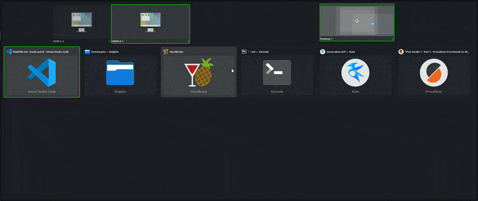

# Dash Launch

- This is 99.9% AI generated! 
- This is a Plasma 6 All-in-one Dashboard, you can manage windows/screens/desktops, search and launch applications, all in one place




### Why?

- I like to have all in one place, by pressing Win button or by moving mouse to the corner i can access everything i need.
So i like gnome dashboard but i dont like gnome.
- I not using Plasma Overview because it opens on all screens, and i dont like its layout
- This is a quick fix to my problem.


### Features

- show opened windows on the current/all screens/virtual desktops(in widget settings)
- applications layouts(in widget settings)
- fullscreen/or 95% of screen size(in widget settings)
- application search through KRunner services(type to search)
- screens and virtual desktops management
- drag&drop windows to desktop/screen
- keyboard navigation

# Controls
#### Mouse
 - Single click: 
 - - window tile - focus window
 - - screen/desktop tile - filter windows by
 - - desktop close button - close empty desktop

 - Double click:
 - - screen/desktop - activate
 - - desktop close button - force close desktop and all its windows

 - Middle click on window tile - close window

#### Keyboard
 - up/down/left/right - navigate
 - enter - activate
 - delete - close selected window

## Install

Install the plasmoid package locally:

Latest(lots of bugs):
```bash
git clone https://github.com/ramaxa9/DashLaunch.git
```

or download and unzip your version https://github.com/ramaxa9/DashLaunch/releases

```bash
cd DashLaunch
sh install.sh
```

Upgrade after edits:

```bash
./install.sh
```
