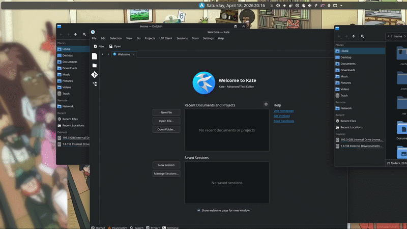

# Dash Launch

- This is 99.9% AI generated! 
- This is a Plasma 6 Gnome-like Applications Dashboard


### Why?

- I like to have all in one place, by pressing Win button or by moving mouse to the corner i can access everything i need.
So i like gnome dashboard but i dont like gnome.
- I not using Plasma Overview because it opens on all screens, and i dont like its layout
- This is a quick fix to my problem.

### What is implemented

- show opened windows on the current/all screens
- show opened windows on the current/all virtual desktops
- application search through KRunner services
- virtual desktops
- keyboard navigation

## Layout

- `package/metadata.json`: plasmoid metadata
- `package/contents/ui/main.qml`: dashboard UI and model wiring

## Install

Install the plasmoid package locally:

```bash
git clone https://github.com/ramaxa9/DashLaunch.git
cd DashLaunch
sh install.sh
```

Upgrade after edits:

```bash
./install.sh
```

## Notes

- The search view uses the `krunner_services` runner, so it focuses on app launching.
- The open windows panel uses Plasma's task manager model and activates or closes windows directly.
- The UI is pure QML, so the quickest extension path is editing `package/contents/ui/main.qml`.
